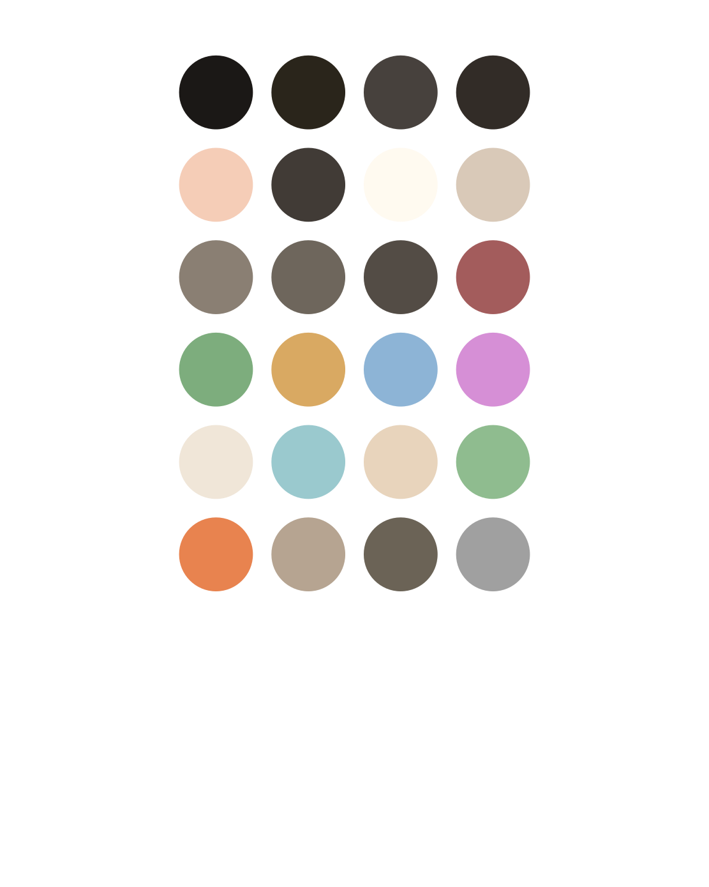

# zed-themes

## poimandres-zed

A faithful and detailed port of the awesome poimandres VS Code theme for Zed.

**Variants:**

- poimandres-zed
- poimandres-zed noitalics
- poimandres-zed storm
- poimandres-zed storm noitalics

## honeycrisp-IIe

A original theme inspired by autumn leaves and the good old beige computer in the basement.

**Variants:**

- honeycrisp-IIe
- honeycrisp-IIe noitalics
- honeycrisp-IIe tang (a little more vivid, imagine you drank some Tang)
- honeycrisp-IIe tang noitalics

## Installation

This project requires Node 24.11.1 or later (Using Node's new TypeScript support `--experimental-transform-types` flag) and uses [pnpm](https://pnpm.io/installation) as its package manager.

1. Install dependencies with `pnpm install`.
2. Start watching the theme files for changes with `pnpm run watch`.

## Commands

- `pnpm run format`: Formats the source files using Prettier.
- `pnpm run poimandres:watch`: Watches `poimandres-zed/theme.ts` and regenerates assets on change.
- `pnpm run poimandres:watch:zed`: Watches `poimandres-zed/theme.ts`, regenerates assets on change, and generates the theme in Zed's theme directory. If you have the theme selected in Zed, you will see theme changes in Zed in real time.
- `pnpm run IIe:watch`: Watches `honeycrisp-IIe/theme.ts` and regenerates assets on change.
- `pnpm run IIe:watch:zed`: Watches `honeycrisp-IIe/theme.ts`, regenerates assets on change, and generates the theme in Zed's theme directory. Select the theme for real time updates.

## Using the Theme in Zed

Once `pnpm run watch:zed` has copied the files, (or by manually copying files in `themes` into `~/.config/zed/themes`) open Zed, use command pallete to select `theme selector: toggle` , and pick the variant you want.

## Contributing

Issues and pull requests are welcome. Please use the provided formatter before committing and describe any visual decisions made so the meticulous baseline can be maintained.
