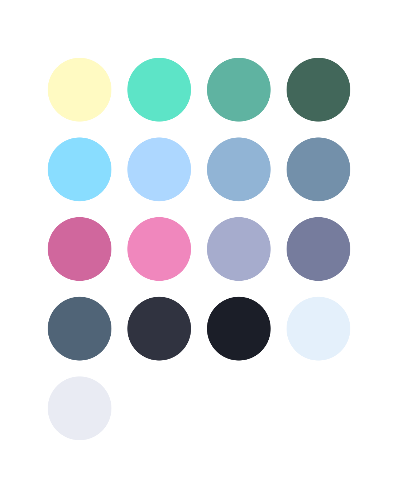

# poimandres-theme-zed

## Overview

A faithful and meticulous port of the awesome poimandres VS Code theme for Zed. Some ports exist, but since Zed's syntax highlighting customization is not to the level of VS Code's just yet, some colors in those ports that poimandres uses sparingly are overrepresented in the actual buffer. This project makes the best compromises on syntax colors to offer as consistent colors with VS Code as possible. When decisions needed to be made, the lighter of the two color options was usually chosen for readability.

## Installation

This project requires Node 24.11.1 or later (Using Node's new TypeScript support `--experimental-transform-types` flag) and uses [pnpm](https://pnpm.io/installation) as its package manager.

1. Install dependencies with `pnpm install`.
2. Start watching the theme files for changes with `pnpm run watch`.

## Commands

- `pnpm run format`: Formats the source files using Prettier.
- `pnpm run watch`: Watches `theme.ts` and regenerates assets on change.
- `pnpm run watch:zed`: Watches `theme.ts`, regenerates assets on change, and generates the theme in Zed's theme directory. If you have the theme selected in Zed, you will see theme changes in Zed in real time.

## Using the Theme in Zed

Once `pnpm run watch:zed` has copied the files, (or by manually copying `poimandres-zed.json` into `~/.config/zed/themes`) open Zed, use command pallete to select `theme selector: toggle` , and pick the variant you want:

- `poimandres zed`
- `poimandres zed storm`
- `poimandres zed noitalics`
- `poimandres zed noitalics storm`

## Contributing

Issues and pull requests are welcome. Please use the provided formatter before committing and describe any visual decisions made so the meticulous baseline can be maintained.
